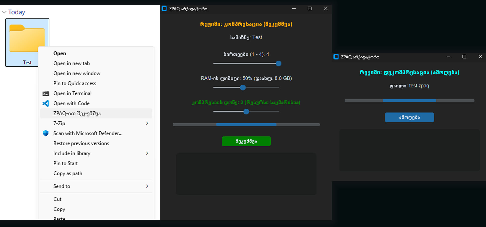

# Zkumshva (შეკუმშვა)
ZPAQ-ზე დაფუძნებული მძლავრი არქივატორი ქართული გრაფიკული ინტერფეისით. პროგრამა პირდაპირ ინტეგრირდება Windows-ის მარჯვენა ღილაკის მენიუში და გთავაზობთ ფაილების მაქსიმალურ შეკუმშვას სისტემური რესურსების ზუსტი კონტროლით.

## 🚀 მთავარი ფუნქციები
* **Windows ინტეგრაცია:** იხსნება მარჯვენა ღილაკით (Context Menu) ნებისმიერ ფაილსა და საქაღალდეზე.
* **რესურსების კონტროლი:** თავად ირჩევთ რამდენი ბირთვი (CPU) და ოპერატიული მეხსიერება (RAM) გამოიყენოს პროგრამამ.
* **ჭკვიანი ინდიკატორი:** ავტომატურად ითვლის და გაჩვენებთ, ეყოფა თუ არა კომპიუტერის რესურსი არჩეულ კომპრესიის დონეს (m1-დან m5-მდე).
* **მარტივი დეკომპრესაცია:** `.zpaq` ფაილზე დაჭერით პირდაპირ იხსნება ამოღების ფანჯარა.

## ⚙️ ინსტალაცია
1. ჩამოტვირთეთ პროექტის ფაილები.
2. დარწმუნდით, რომ `Zkumshva.exe`, `zpaq.exe` და `addZkumshva.exe` ერთ საქაღალდეშია.
3. გაუშვით **`addZkumshva.exe`** აუცილებლად **ადმინისტრატორის უფლებებით** (Run as Administrator). 
*პროგრამა ავტომატურად ჩაიწერება `C:\Program Files\ZPAQ_App`-ში და დაემატება Windows-ის რეესტრში.*

## 🛠️ როგორ გამოვიყენოთ
* **შეკუმშვა:** დააჭირეთ მარჯვენა ღილაკს ნებისმიერ ფაილზე ან საქაღალდეზე -> აირჩიეთ "ZPAQ-ით შეკუმშვა". მიუთითეთ სასურველი პარამეტრები და დააჭირეთ დაწყებას.
* **ამოღება:** დააჭირეთ მარჯვენა ღილაკს შეკუმშულ `.zpaq` ფაილზე -> აირჩიეთ "ZPAQ-ით ამოღება/შეკუმშვა" და დააჭირეთ ღილაკს ამოღება.

## 🗑️ წაშლა
პროგრამის სისტემიდან და მარჯვენა ღილაკის მენიუდან სრულად წასაშლელად, გაუშვით **`RemoveZkumshva.exe`** ადმინისტრატორის უფლებებით.

## 📊 კომპრესიის დონეები (ZPAQ m1 - m5)
* **m1:** ყველაზე სწრაფი შეკუმშვა. იყენებს მცირე მეხსიერებას (დაახლ. 0.1 GB თითო ბირთვზე).
* **m2:** ოდნავ ნელი, მაგრამ უკეთესი შეკუმშვის დონე (დაახლ. 0.25 GB ბირთვზე).
* **m3 (ნაგულისხმევი):** იდეალური ბალანსი სისწრაფესა და მაღალ შეკუმშვას შორის (დაახლ. 1.0 GB ბირთვზე).
* **m4:** ძალიან ძლიერი შეკუმშვა. ნელია და მოითხოვს დიდ რესურსს (დაახლ. 4.0 GB ბირთვზე).
* **m5:** ექსტრემალური შეკუმშვა. მაქსიმალურად კუმშავს ფაილს, მაგრამ არის ძალიან ნელი და მოითხოვს უზარმაზარ რესურსს (დაახლ. 16.0 GB თითო ბირთვზე!). 

